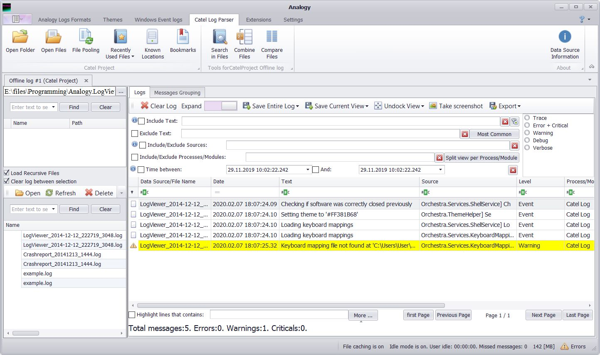

# Analogy Parser for CatelProject  
Analogy Parser for Catel Project logs

Example screenshot:

## How To Use
1. Download the latest [Analogy Log Viewer](https://github.com/Analogy-LogViewer/Analogy.LogViewer) from the [release](https://github.com/Analogy-LogViewer/Analogy.LogViewer/releases) section (.net framework or .net Core version).
2. Download (or Compile) this project and put the compiled DLL in the same folder as the Analogy Log Viewer.
